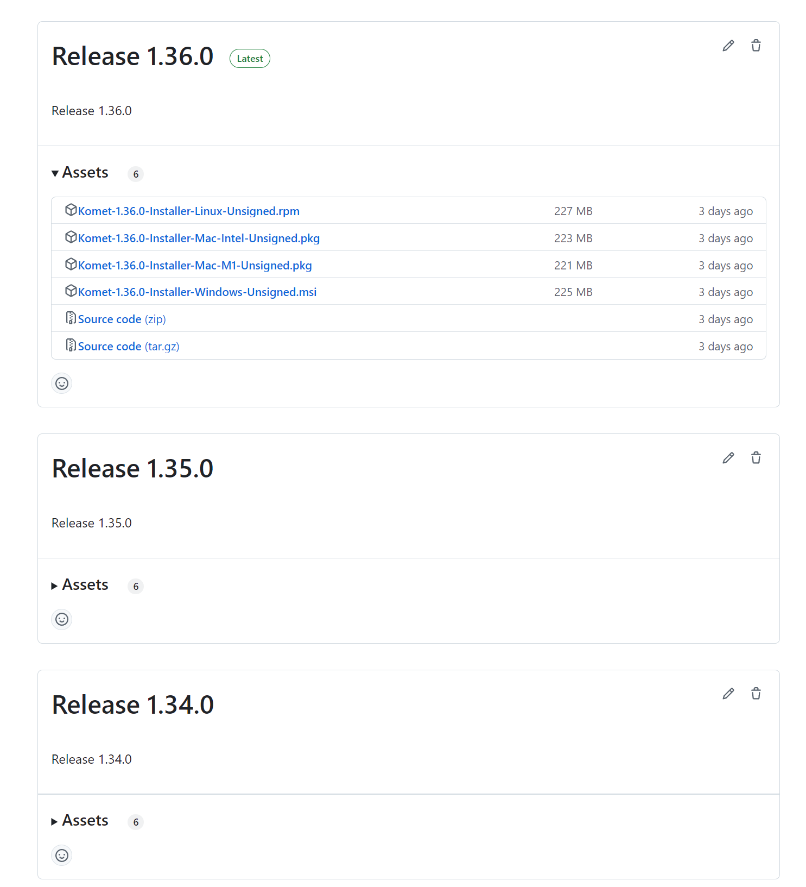
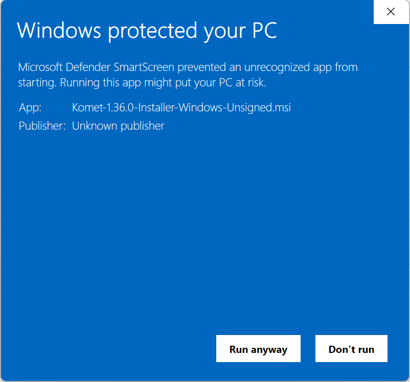

# Komet-java

[](https://sonarcloud.io/summary/new_code?id=ikmdev_tinkar-core)
[](https://sonarcloud.io/summary/new_code?id=ikmdev_tinkar-core)
[](https://sonarcloud.io/summary/new_code?id=ikmdev_tinkar-core)

[Komet](https://www.ikm.dev/platform) was created to harmonize existing medical terminology and create interoperable
data. This file will explain best practices for getting started, building, running, and contributing code in Komet.

### Team Ownership - Product Owner
Install App Team

## Project Overview
This intention of this (Komet) project is to provide a user-friendly interface that lets the user view, analyze, change, create,
import and export the various medical terminologies. All the terminology changes and their relationships are saved and can be
viewed historically.

# Getting Started
## Installation Instructions
### Pre-requisites:
1. You should have copy of a local DB available and configured. If not then please request for one.
2. Uninstall any previously installed versions of Komet.

### Installing Komet on your local machine:
1. To get started with installing and using Komet, [browse to the available releases in GitHub](https://github.com/ikmdev/komet/releases). See the
   documentation about the new features included in each release.
2. Download the appropriate installation file for your machine (_example, for Windows OS download **Komet-X.X.X-Installer-Windows-Unsigned.msi**_).
3. Once the download is complete, run the downloaded file and install Komet.
4. Follow the (if-any) installation instructions. For Windows if you get a security alert click on "**_Run anyway_**" option.
5. Komet is now installed on your local machine. You can now run Komet from programs or installed directory.

## Follow the instructions below to set up the local environment for Komet
### Pre-requisites:
1. Local Git repo and GitBash or similar shell-prompt installed/configured on your local machine.
2. Set up GitHub by following the [instructions provided here](https://ikmdev.atlassian.net/wiki/spaces/IKM/pages/390201368/GitHub+Account+Creation+IKM+FDA+Shield)
3. Download and install Open JDK Java 21 or greater [latest version](https://openjdk.org/projects/jdk/)
4. Download and install Apache Maven 3.9 or greater [link here](https://maven.apache.org/download.cgi)
5. Prior to building Komet, there are additional repositories to clone and build. Please use
   the [`tinkar-core` README](https://github.com/ikmdev/tinkar-core/blob/main/README.md) file to build the `tinkar-core`
   project and its prerequisites before building `komet`.

### Building and Running Komet locally:
1. Once you have access to [komet repository](https://github.com/ikmdev/komet) on GitHub, fork the repository using instructions
   provided in "_**Fork the Repository**_" section in [GitHub document](https://ikmdev.atlassian.net/wiki/spaces/IKM/pages/390201368/GitHub+Account+Creation+IKM+FDA+Shield).
2. Clone the forked Komet repository on your local machine by running the git bash command.
   ```bash
   git clone git@github.com:your-github-username/komet.git
   ```
3. Change the local directory location to `komet`
4. Enter the following command to build the application:
   ```bash
   mvn clean install
   ```

5. Run the Komet application with the following command:
   ```bash
   mvn -f application javafx:run
   ```
6. You can open Komet code using your favorite IDE like _Eclipse_ or _IntelliJ Idea_ and try running it from there.
   While running Komet UI from your IDE, you many have to add the following VM arguments:
   ```
   -Xmx10g --add-exports javafx.controls/com.sun.javafx.scene.control.behavior=dev.ikm.komet.navigator
   ```

## Running Komet with JPro locally
After building Komet, you can run it with JPro on your local machine by following these steps:
1. Execute the following command to run the Komet application in your web browser:
   ```bash
   mvn -f application -Pjpro jpro:run
   ```
   The default web browser should open automatically, displaying the Komet application. If it doesn't, navigate
   to `http://localhost:8080` in your browser.
2. To stop the application, press `Ctrl + C` in the terminal where the application is running.
3. To rerun the application, repeat step 1.

## Running Komet with JPro in a Docker Container
To run Komet with JPro in a Docker container, follow these steps:
1. Create the application release zip for deployment using the following command:
   ```bash
   mvn clean -f application -Pjpro jpro:release
   ```
   The release zip will be created in the `application/target` directory, named `komet-jpro.zip`.
2. Transfer the `komet-jpro.zip` file to the directory where you want to run the Docker container.
3. Extract the contents of `komet-jpro.zip` file and navigate to the extracted folder.
4. To run the application in a Docker container, choose one of the following options:
    * **Option 1**: Build the Docker image and run the Docker container manually
        * Inside the unzipped directory, locate the `Dockerfile`.
        * Build the Docker image with the following command:
          ```bash
          docker build -t komet-jpro .
          ```
        * Run the Docker container using the following command:
          ```bash
          docker run -d -v ~/Solor:/root/Solor -p 8080:8080 komet-jpro
          ```
          Note: `-v ~/Solor:/root/Solor`: This option mounts a volume, mapping a directory on your host machine to
          a directory inside the container.
            * **~/Solor**: Path to the dataset directory on your local system.
            * **/root/Solor**: Path inside the container where the dataset will be accessible.
    * **Option 2**: Use Docker Compose
        * Within the extracted directory, find the `docker-compose.yml` file.
        * Start the Docker container with Docker Compose by running:
          ```bash
          docker compose up -d
          ```
5. The application should now be running in the Docker container. Access it by navigating to `http://localhost:8080`
   in your web browser. If running on a remote server, replace localhost with the server’s IP address.

## Running Komet GUI Tests Using the TestFX Framework
The Komet application includes GUI tests built with the TestFX framework. By default, these tests run in headless mode,
which is ideal for continuous integration (CI) environments or situations where graphical interaction is unnecessary.
1. **Running TestFX Tests in Headless Mode (Default)**<br>
   To execute all unit tests, including the TestFX GUI tests, in headless mode (without launching a GUI window), run:
   ```bash
   mvn test
   ```
2. **Running TestFX Tests in Graphical Mode (Non-Headless)**<br>
   If you need to observe the GUI during testing—for instance, when debugging UI components—you can disable
   headless mode by setting the headless property to false.<br>
   To run all tests in non-headless mode:
   ```bash
   mvn test -Dheadless=false
   ```
3. **Running Specific Tests**<br>
   To run a specific test class in a specific module, for example the `LoginTest` class in the `kview` module:
   ```bash
   mvn test -pl kview -Dtest=LoginTest -Dheadless=false
   ```
   To run a specific test method inside a specific class, for example the `testSuccessfulAuthentication` method in the
   `LoginTest` class in the `kview` module:
     ```bash
    mvn test -pl kview -Dtest=LoginTest#testSuccessfulAuthentication -Dheadless=false
     ```
**Important Note on Test Execution**<br>
The tests will only run once after they pass successfully. To trigger the tests again, changes must be made
to any part of the project.

## Usage Examples:
This section details on the basic design methodology used for developing nex-gen Komet UI.
1. Komet UI application is moving towards the nex-gen implementation which follows Model-View-View-Model (MVVM) design pattern.
2. Komet application design is event-based where the subscriber to an event listens for a particular event and when it is triggered,
desired logic can be executed in the listener code.
Example:
   ```java
   import java.util.UUID;
   
   public class MyController {
      private EvtBus eventBus;
      private Subscriber<MyDefienedEvent> someMyDefinedEventSubscriber;
   
      public void initialize() {
         someMyDefinedEventSubscriber = evt -> {
            // Some logic to process the event.
            if (evt.getEventType() == MyDefienedEvent.SOME_EVENT_1) {
               // do something.
            } else if (evt.getEventType() == MyDefienedEvent.SOME_EVENT_2) {
               //do something else.
            }
         };
         eventBus.subscribe(myTopic, MyDefienedEvent.class, someMyDefinedEventSubscriber);
      }
   }
   
   public class MyDefienedEvent extends Evt {
      public static final EvtType<MyDefienedEvent> SOME_EVENT_1 = new EvtType<>(Evt.ANY, "SOME_EVENT_1");
      public static final EvtType<MyDefienedEvent> SOME_EVENT_2 = new EvtType<>(Evt.ANY, "SOME_EVENT_2");
   
      /**
       * Constructs a prototypical Event.
       * You can optionally pass arguments in this constructor and set the value as final in the constructor.
       * The value can be retrived using the getter method for that variable.
       * @param source         the object on which the Event initially occurred
       * @param eventType
       */
      public MyDefienedEvent(Object source, EvtType eventType) {
         super(source, eventType);
      }
   }
   
   public class MySomeClass {
      private EvtBus eventBus;
      private UUID someTopic;
      
      public MySomeClass(UUID someTopic){
          this.someTopic = someTopic;
      }
      
      public void someMethod() {
         eventBus.publish(someTopic, new MyDefienedEvent(this, MyDefienedEvent.SOME_EVENT_1));
      }
   }
   
   public class MainClass {
      public static void main(String[] args) {
         MySomeClass mySomeClass = new MySomeClass(UUID.randomUUID());
      }
   }
   ```
4. Komet's design also includes the cognitive framework to implement MVVM architecture framework.
You can find more information along with the examples [here](https://github.com/carldea/cognitive/wiki)
   1. Gradle:
      ```
      implementation 'org.carlfx:cognitive:1.3.0'
      ```
   2. Maven
      ```
      <dependency>
      <groupId>org.carlfx</groupId>
      <artifactId>cognitive</artifactId>
      <version>1.3.0</version>
      </dependency>
      ```
   3. Project using Java Modules (JPMS) will want to do the following in the consuming module:
      ```
      requires org.carlfx.cognitive;
      ```

## Configuration Options
1. No specific configuration is required to run the installed version of Komet.
2. To run Komet from an IDE (development environment), you will have to do some VM configuration as below:
   ```
   -Xmx10g --add-exports javafx.controls/com.sun.javafx.scene.control.behavior=dev.ikm.komet.navigator
   ```
3. The DB needs to be configured under the '_**users -> SOLAR**_' directory.
4. Komet requires sample data to operate with full functionality

## Issues and Contributions
Technical and non-technical issues can be reported to the [Issue Tracker](https://github.com/ikmdev/komet/issues).

Contributions can be submitted via pull requests. Please check the [contribution guide](doc/how-to-contribute.md) for more details.
