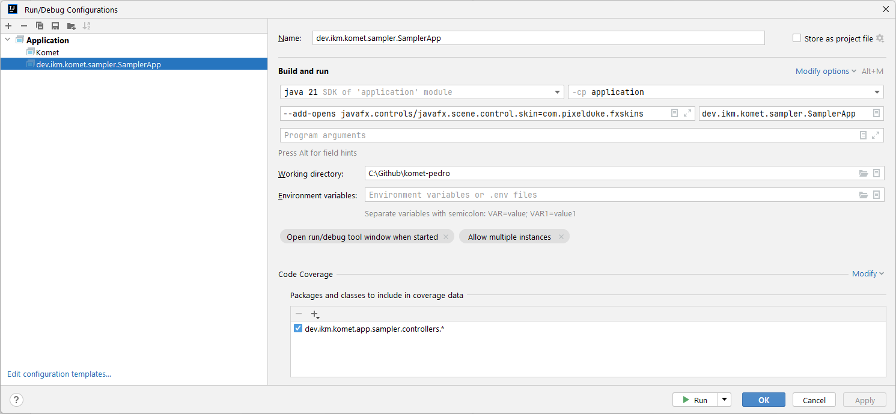

# Running the Sampler

To run the Sampler in Intellij do the following:  

1 - Menu "Run" -> "Edit Configurations...";  
2 - A Dialog opens, press the "+" button at the top left of that Dialog;  
3 - Select "Application";  
4 - Click "Modify options" in the popup that appears make sure "Add VM Options" is checked;    
5 - Copy paste this: "--add-opens javafx.controls/javafx.scene.control.skin=com.pixelduke.fxskins" into the "VM Options" textfield;    
6 - For the module select the "Appliction" module;   
7 - Main class should be: "dev.ikm.komet.sampler.SamplerApp";        
8 - That's it you're all set. You can now click run.  

Here's a screenshot of how the run dialog looks after it has been set up:

