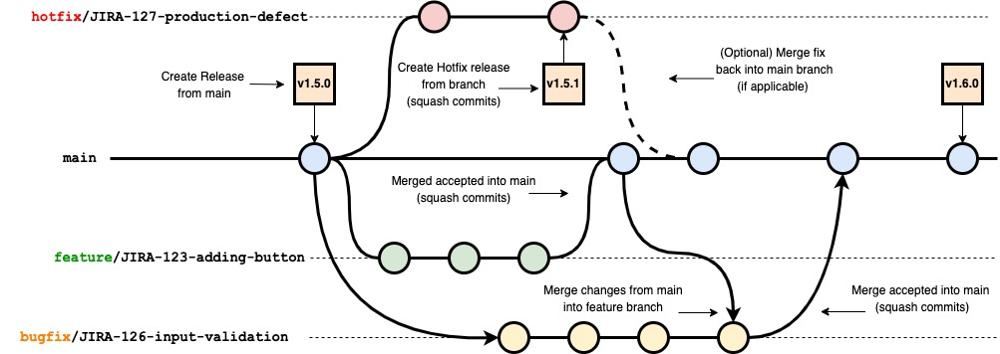

# How to Contribute

If you would like to create a new feature or a bugfix, there are a couple of conventions that should be followed for the team to be able to act on your request. This includes understanding our current branching pattern. Also, we will cover how to recover from a build failure, indicating there was a problem with your code.

## Fork the Repository

In order to ensure code quality, we recommend forking the repository you wish to contribute to rather than cloning the repository directly and then submitting a pull request from the forked repository. To create a fork, go to the repository in the web UI and click on the "Fork" button. Then select your account. This will create a fork of the repository in your account. You can then clone the fork to your local machine. To do this, go to your forked repository in the web UI and click on the "Code" button. Then click on the "SSH" button. Copy the URL and run the appropriate `git clone` command in your CLI.

## Create a Branch Using Maven

Before beginning development, create a new branch designated for the work you are about to do using Maven plugin commands.

| Branch Type | Maven Command | Outcome |
| ------ | ------ | ------ |
| Feature Branch | `mvn gitflow: feature-start` | Creates a new feature branch and updates the Komet version |
| Hotfix Branch | `mvn gitflow: hotfix-start` | Creates a new hotfix branch and updates the hotfix version |

Maven will prompt you to create a name for your new feature or hotfix branch. The branch name should follow the convention of starting with a JIRA project code (IKM, AR, IAT, IC, IKMC, IKDT, IKMD, IIA, IKMW, IKMM, or TE), followed by a dash, followed by the issue number it applies to, followed by a short description (without spaces) (e.g., `IA-30-branch-documentation`). If there is no JIRA ticket, it is ok to move on without one, but this will be applied at a later point by a team developer as they are reviewing and merging it in.

Once your new branch has been created, begin development in your newly created branch. 

**Note:** There is currently no way to create a bugfix branch using the Maven plugin. You can create a bugfix branch using the git commands in the [Common Git Commands](#common-git-commands) section below.

#### Create a Branch Using Git

Sometimes you don't want to or cannot use the maven plugin, so git can be used directly to create a branch. This works by running the following commands to create your branch:

```bash
git pull origin main
git checkout -b feature/MYAPP-52-some-short-description
mvn versions:set -DnewVersion=MYAPP-52-some-short-description
```
Follow the same branch naming convention illustrated above.

## Collaborate with Others

To collaborate with others in your feature branch, run the following command to push your changes to a remote branch:
```bash
git push origin HEAD:feature/[MY LOCAL BRANCH NAME]
```

This will allow other developers to pull your code. Don't forget to run `git add .` and `git commit -m "[MESSAGE]"` before pushing your code.

## Submit Your Code

Ideally at this point, you have created an isolated change, which are best for code reviews, cherry-picking and
rollbacks. Now you can push your changes.

If you haven't already, run `git add .` and `git commit -m "[MESSAGE]"` to commit your changes. Then run `mvn gitflow:feature-finish` to complete your Maven feature and update the version. This will push your code to the main branch of your repository.

Finally, [create a pull request][3] based off your main branch to the main branch of the original repository.

**Note:** It is recommended to wait for your pull request to be approved and merged into the original repository before starting a new feature branch to avoid having multiple features in your main branch. Having multiple features in your main branch will make less clear which changes are for which feature (i.e., which JIRA ticket) when pulling changes into the original repository.

## Additional Guidelines

### Branch Names

The system expects short running branches and you must merge back to the main branch as the only supported automated deployment option. Also, metrics will eventually be gathered on branches to report on any long-running branches. All repositories created by the DevSecOps tooling meet and follow the following rules on branches:

| Branch Name | Description                                                                             |
|-------------|-----------------------------------------------------------------------------------------|
| main        | The primary branch that defines the current state of your code. This is protected in that only merge requests can happen on this branch. This should be at production quality at all times. |
| master      | A protected branch that is blocked to guarantee that no one uses main as a primary branch (for consistency). |
| production  | A protected branch that is blocked to guarantee that no one uses main as a long-running branch, and that all releases happen from the "main" branch. |
| prod        | Similar to "production", making sure that folks do not create long-running branches. No one should use. |
| feature/*   | Used when extending the functionality of the services contained in the repository. This is utilized in standard Feature Branching Workflows within a project. The name (after "feature/") must start with one or more JIRA issue numbers (e.g. `feature/JIRA-123-example-feature`). Feature branches should be a representation of a well defined task/story directly associated with the branch. A feature branch should be very focused and something that can be accomplished within a one or two day period. This process helps maintain that the working branch and the main production branch stay in a similar parity with each other. Feature branches are meant to be short-lived and should be flagged if they are not destroyed within 2-3 days. |
| bugfix/*    | Used when fixing defects releases. The name (after "bugfix/") must start with one or more JIRA issue numbers (e.g. `bugfix/JIRA-123-bugfix-problem`). Like a feature, they are limited in scope and should be tied to a specific defect story in JIRA. |
| hotfix/*    | Used when patching releases. The name (after "hotfix/") must start with one or more JIRA issue numbers (e.g. `hotfix/JIRA-123-emergency-fix`). Releases are expected be tagged in this branch. |

### Feature Branching and Version Tags

The convention for Development Libraries/Frameworks and Software components is to use **Linear**, [Trunk-Based][1] Development approach to writing, merging, and shipping code on the platform. This approach will help avoid problems that arise with merging and allow for a faster development process. For some background on why we don't suggest git-flow, but rather enforce linear development, please visit [this article][2]. All pull requests should be building and only approved pull requests should have an executed pull/merge request. This means that the `main` branch is always in a good shape to ship to deploy.

Version tags, similarly should be created primarily off of the `main` branch, the exception being hotfixes, which should be adjustments to the last release. If there is a `1.5.0` tag, you check out the tag and make changes to that codebase and release from that branch. Similarly, if you need to execute additional hotfixes, you would check out the `1.5.1` tag and tag from that branch. Though you can merge these changes back to main, it is optional and often easier to put in a separate bugfix ticket to correct in the main branch separately. This is entirely dependent on how quickly the codebase is changing though. One with little changes will allow for merge back easily. One with massive refactoring, you might as well just do it separately. Either way, it is suggested that these are tracked separately in JIRA.

This would look something like this, allowing for concurrent feature development, bugfixes, and hotfixes:



### Commit Conventions

Committing frequently is good practice as these incremental checkpoints can be recovered if necessary. However, remember that the commits of a branch going into the `main` branch should be squashed.

```text
# Example Commit Message
<Title> Changed ALB certificate to use a wildcard certificate

<About> Allows the creation of a single ACM wildcard certificate
        to be used for all inbound A records instead of independent
        certs for subdomain records.1
```

### Common Git Commands

This entry level section introduces basic git operations. It explains foundational git concepts such as staged changes, un-staged changes, and the `.gitignore` file. It also covers the most common components of the classic git workflow. And finally, a sample development project (using git for source control) is presented to illustrate git concepts in a concrete manner. The example development project makes use of a basic repository structure and begins with the initialization of the git repository.

```bash
## Fetch Code Index
git fetch

## Fetch Code Index and Merge with current Branch
git pull

## Create Branch
git checkout -b feature/MYAPP-52-some-short-description

## determine if any changed files have not been added to the index, and how far off the baseline this is.
git status

## Do work and track changes on a single file (as many times as you want)
git add README.md

## Do work and track all changes (as many times as you want)
git add .

## Commit work on tracked changes
git commit -m "A short comment describing the work since the last commit"

## Push the changes to the team repo (assuming you have access). Can push more changes later until branch is deleted.
## You can then follow the instructions below to create a pull/merge request.
git push origin feature/MYAPP-52-some-short-description

## Add another remote
git remote add myname https://git@mylocation.example

## Push the changes to the other remote. Can push more changes later until branch is deleted. You can then follow
## the instructions below to create a pull/merge request.
git push myname feature/MYAPP-52-some-short-description

## Delete a branch locally
git branch -d feature/MYAPP-52-some-short-description
```

[1]: <https://trunkbaseddevelopment.com> "Trunk Based Development"

[2]: <https://githubflow.github.io> "GitHub Flow"

[3]: <https://docs.github.com/en/pull-requests/collaborating-with-pull-requests/proposing-changes-to-your-work-with-pull-requests/creating-a-pull-request-from-a-fork> "Creating a Pull Request"
